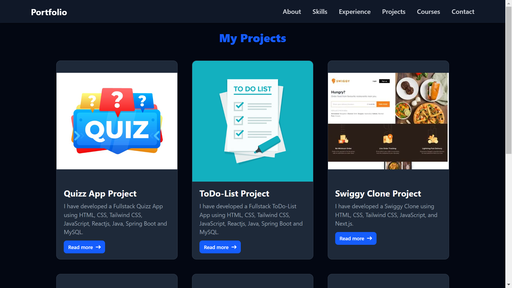

# 💼 My Portfolio Website

Welcome to my personal portfolio website!  
This project showcases my skills, projects, and experiences as a developer. It’s built with a modern tech stack and designed to provide visitors with a smooth and interactive experience.

## 🚀 Project Overview

This portfolio serves as a professional presentation of my journey, including:

- Introduction/About Me
- Skills (Frontend, Backend, Tools)
- Projects with links
- Resume download
- Contact form
- Responsive design for mobile and desktop

Feel free to explore and get to know more about my work and what I’m passionate about!

## 🛠️ Technologies Used

### Frontend
- **ReactJS** – JavaScript library for building UI
- **TailwindCSS** – Utility-first CSS framework for styling
- **Framer Motion** – Animation library for React
- **React Router DOM** – Routing and navigation

### Assets
- Custom illustrations, images, and icons

## 🌐 Hosting

The website is deployed and live on **Netlify**.

🔗 [Visit My Live Portfolio](https://portfolio-yashwalke.netlify.app/)

## 📸 Screenshots

<!-- You can add image links here -->



## ✨ Features

- Modern and responsive UI/UX
- Animated transitions and page effects
- Clean project showcase
- Integrated contact form (configurable with Formspree/EmailJS)
- Downloadable resume
- Custom 404 Not Found page with animation

## 🧪 How to Run Locally

```bash
# 1. Clone the repository
git clone https://github.com/Yash-6503/Portfolio-App.git

# 2. Navigate into the project directory
cd your-portfolio

# 3. Install dependencies
npm install

# 4. Start the development server
npm run dev
